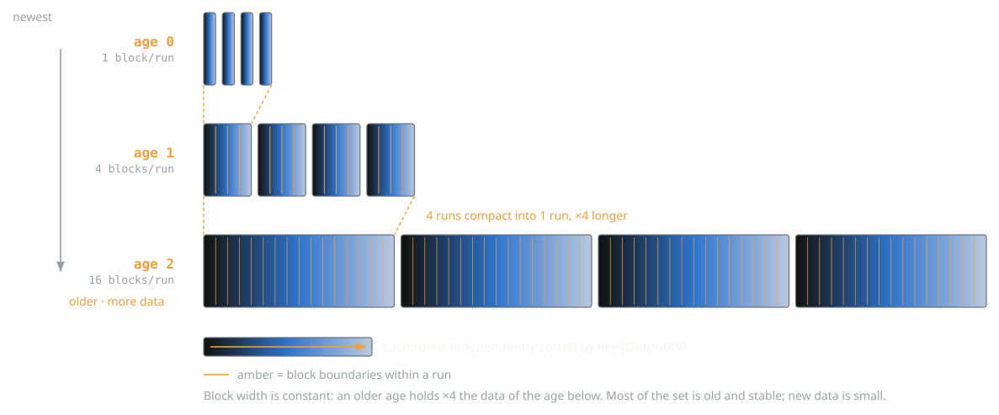
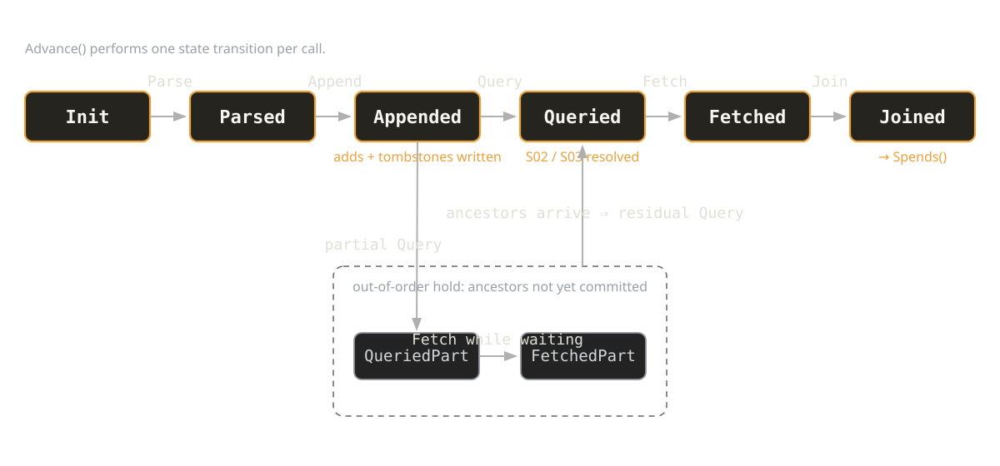
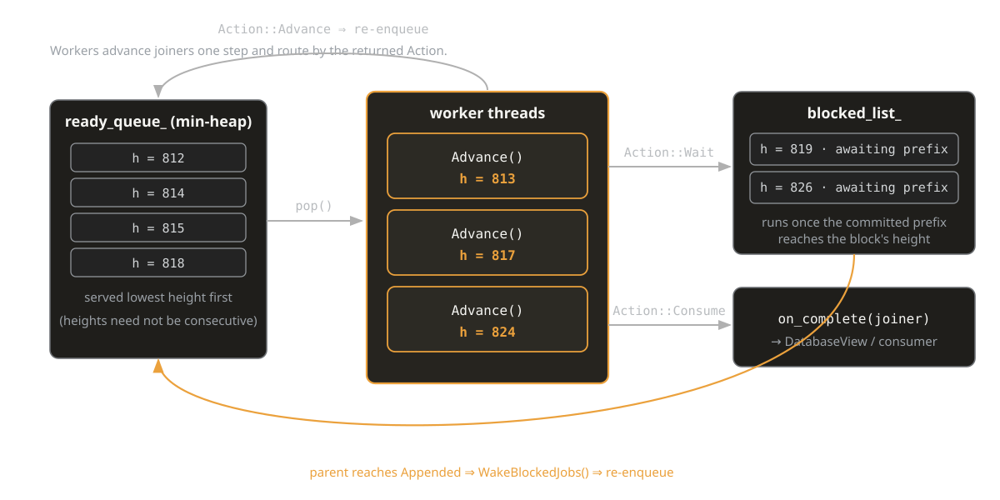

<!-- _class: title -->


<div class="content">
<h1>A Minimal, Executable Specification<br/>for Bitcoin Consensus</h1>
<div class="author">Toby Sharp</div>
<div class="event">Brink Engineering Call · 10 June 2026</div>
</div>

---

# Every major protocol has a technical specification.

| Category | Protocols |
|---|---|
| **Network** | HTTP, TCP/IP, TLS, DNS, SMTP |
| **Wireless** | Wi-Fi, Bluetooth, NFC |
| **Web** | HTML, CSS, JavaScript |
| **Languages** | C, C++, Java |
| **Media** | JPEG, MPEG, HDTV, CD, DVD, BluRay |
| **Data** | PDF, XML, JSON, Unicode |
| **Hardware** | USB, HDMI, PCIe, Thunderbolt |
| **Cryptography** | AES, RSA, SHA, ECDSA |

**Bitcoin** |  `bitcoin/src/*` ?

---

# The brittleness problem

<div class="bar-item">
<div class="bar-title">Code is the spec</div>
<div class="bar-body">Consensus rules live inside one codebase, entangled with storage, threading, and state.</div>
</div>

<div class="bar-item">
<div class="bar-title">Refactoring is risky</div>
<div class="bar-body">Any deep change might alter implicit behaviour. Reviewers must verify nothing shifted — by hand.</div>
</div>

<div class="bar-item">
<div class="bar-title">Software ossifies</div>
<div class="bar-body">The protocol should ossify. The software shouldn't. But when they're fused, both freeze together.</div>
</div>

<div class="bar-item">
<div class="bar-title">Client monoculture</div>
<div class="bar-body">Without a specification, the only safe implementation is the reference codebase. Client diversity becomes a consensus risk rather than a resilience feature.</div>
</div>

---

# What is Hornet?

**A specification of Bitcoin consensus**
Including 35 semantic rules defining block validity, in plain language and executable code.

**A consensus validation library**
Evaluating whether a block meets the consensus specification.

**An experimental IBD client**
Able to sync and validate mainnet to tip.

---

# Two approaches to sharing consensus

## Both share the consensus rules. The question is what comes attached.

<div class="two-col">
<div class="col">
<h3 class="white">libbitcoinkernel</h3>
<p class="col-desc">Shares an implementation</p>
<p class="white"><i>"How do we let other clients share Core's consensus behavior?"</i></p>
<p>The rules are welded to implementation choices: state model, memory layout, disk format, API, sequential processing.</p>
<p>You inherit the whole stack with its limitations to get the rules.</p>
</div>
<div class="col">
<h3 class="orange">Hornet</h3>
<p class="col-desc">Shares a specification</p>
<p class="white"><i>"What does consensus look like written from scratch, based on a specification?"</i></p>
<p>The pure semantic logic of consensus, with no implementation attached.</p>
<p>Shared semantics, independent implementations — written by hand or generated from the spec.</p>
</div>
</div>

---

# Properties of a specification

<div class="bar-item">
<div class="bar-title">Semantic</div>
<div class="bar-body">Meaningful rules and definitions. One logical invariant per rule, with a plain-language reading.</div>
</div>

<div class="bar-item">
<div class="bar-title">Declarative</div>
<div class="bar-body">What must be true to stay in consensus, not how to compute it.</div>
</div>

<div class="bar-item">
<div class="bar-title">Pure</div>
<div class="bar-body">No side effects, mutable state, or dependency on memory/threading/data model. Implementation-neutral by construction.</div>
</div>

<div class="bar-item">
<div class="bar-title">Executable</div>
<div class="bar-body">Compiles, runs, validates mainnet to tip. Testable against Core on historical and putative blocks.</div>
</div>

---

# Hornet's roadmap
 
<div class="step step-active"><div class="step-num">1</div><div class="step-text"><div class="step-title">English semantic spec <span class="badge badge-done">DONE</span></div><div class="step-note">The readable view: 35 named rules for block validation</div></div></div>
<div class="step step-active"><div class="step-num">2</div><div class="step-text"><div class="step-title">Declarative C++ spec <span class="badge badge-done">DONE</span></div><div class="step-note">The executable view: the same rules, validating mainnet to tip</div></div></div>
<div class="step step-future"><div class="step-num">3</div><div class="step-text"><div class="step-title">Differential testing at scale <span class="badge badge-wip">NEXT</span></div><div class="step-note"><span class="orange">Empirical</span> — reject paths and constructed invalid blocks, across implementations</div></div></div>
<div class="step step-active"><div class="step-num">4</div><div class="step-text"><div class="step-title">Pure functional DSL <span class="badge badge-wip">IN PROGRESS</span></div><div class="step-note">One artifact, both readable and executable — no correspondence to maintain</div></div></div>
<div class="step step-future"><div class="step-num">5</div><div class="step-text"><div class="step-title">DSL-driven implementations</div><div class="step-note"><span class="orange">Constructive</span> — consensus logic generated from one spec, correct by construction</div></div></div>
<div class="step step-future"><div class="step-num">6</div><div class="step-text"><div class="step-title">Formal verification against the spec</div><div class="step-note"><span class="orange">Deductive</span> — a machine-checked proof across all inputs</div></div></div>


---

# The Readable View of Specification

---

# Block Validation Rules

## Semantic: <span class="grey">Each rule is a <span class="white"><i>single meaningful invariant</i></span> property.</span> 
## Declarative: <span class="grey">Rules say <span class="white"><i>what must be true</i></span>, not how to evaluate them.</span>
<br/>

35 rules currently split into:

- **Header Rules** (6): Depend only on headers.
- **Local Rules** (13): Depend only on the current block.
- **Contextual Rules** (7): Depend on a block's position within the chain.
- **Spending Rules** (9): Depend on the previous outputs being spent.

<br/>

Full specification at https://hornetnode.org/spec.html.

<div class="footnote">Rule grouping may change</div>


---

# 1. Header Rules
 
<br>

**H01.** A header MUST reference the hash of a valid parent block.

**H02.** A header's hash MUST NOT exceed its own proof-of-work target.

**H03.** A header's proof-of-work target MUST satisfy the difficulty adjustment formula for the timechain.

**H04.** A header timestamp MUST be greater than the median of its 11 ancestor blocks' timestamps.

**H05.** A header timestamp MUST NOT exceed network-adjusted time plus 2 hours.

**H06.** A header's version number MUST NOT have been retired by any activated soft fork. (See Table 1.)

---

# 2. Local Rules

**L01.** A block MUST contain at least one transaction.
**L02.** A block’s Merkle root field MUST equal the unique Merkle root of its transactions.
**L03.** A block’s serialized size excluding witness flags and data MUST NOT exceed 1,000,000 bytes.
**L04.** A block's first transaction MUST be its only coinbase transaction.
**L05.** <span class="small">A block's legacy signature-operation count over all input and output scripts MUST NOT exceed 20,000.</span>
**L06.** A transaction MUST contain at least one input.
**L07.** A transaction MUST contain at least one output.
**L08.** <span class="small">A transaction's serialized size excluding witness flags and data MUST NOT exceed 1,000,000 bytes.</span>
**L09.** All transaction output amounts MUST be non-negative.
**L10.** The sum of a transaction's output amounts MUST NOT exceed 21,000,000 coins.
**L11.** A transaction's inputs MUST NOT contain duplicate outpoints.
**L12.** A coinbase's sig script size MUST be between 2 and 100 bytes inclusive.
**L13.** A non-coinbase transaction's inputs MUST have non-null previous outputs.

---

# 3. Contextual Rules

**C01.** All transactions in the block MUST be final given the block height and locktime rules.
**C02.** A pre-SegWit block MUST NOT contain any witness data.
**C03.** A block’s total weight MUST NOT exceed 4,000,000 weight units.
**C04.** From BIP34: A coinbase's sig script MUST begin by pushing the block height.
**C05.** From BIP141: A block containing witness data MUST contain a witness commitment.
**C06.** <span class="small">From BIP141: A post-Segwit block containing a witness commitment MUST contain a witness nonce.</span>
**C07.** <span class="small">From BIP141: A post-SegWit block containing a witness commitment MUST commit to its witness Merkle root and nonce.</span>


---

# 4. Spending Rules

**S01.** <span class="small">Transaction outputs MUST NOT give rise to outpoints that reference existing unspent outputs, except in blocks listed in Table 2.</span>
**S02.** A non-coinbase input MUST reference an output created in a preceding transaction.
**S03.** A non-coinbase input MUST NOT reference an output that was spent in a preceding transaction.
**S04.** The total signature-operation cost over all transactions MUST NOT exceed 80,000.
**S05.** The total amount in coinbase outputs MUST NOT exceed the block reward.
**S06.** <span class="small">The sum of output values in a transaction MUST NOT exceed the sum of all input values being spent.</span>
**S07.** A non-coinbase input MUST satisfy the spent output's locking script.
**S08.** <span class="small">From BIP68: Each input that signals a relative lock-time interval MUST have reached relative finality.</span>
**S09.** Coinbase outputs MUST NOT be spent before 100 blocks after their creation.

---

# The Executable View of Specification

---

# Rule functions

> Each semantic rule is enforced by one pure validation function, with its own unique error code.
> There are no state mutations and no side effects.
> Each rule function tests only for its own invariant.

## Example

**H02.** A header's hash MUST NOT exceed its own proof-of-work target.

```cpp
// A header's hash MUST NOT exceed its own proof-of-work target.
[[nodiscard]] inline Result ValidateProofOfWork(const HeaderValidationContext& context) {
  const auto hash = context.header.ComputeHash();
  const auto target = context.header.GetCompactTarget().Expand();
  if (hash > target) return Error::Header_InvalidProofOfWork;
  return {};  // Success
}
```

---

> Consensus rules have no dependencies on the timechain data representation.


## Example

**H04.** A header timestamp MUST be greater than the median of its 11 ancestor blocks' timestamps.

```cpp
// A header timestamp MUST be greater than the median of its 11 ancestor blocks' timestamps.
[[nodiscard]] inline Result ValidateMedianTimePast(const HeaderValidationContext& context) {
  if (context.header.GetTimestamp() <= context.view.MedianTimePast()) return Error::Header_BadTimestamp;
  return {};
}
```

```cpp
// Represents a read-only view onto the ancestors of a candidate block header.
class HeaderAncestryView {
 public:
  // Returns the MTP (Median Time Past) of the tip. Calls into LastNTimestamps.
  uint32_t MedianTimePast() const;

  // Returns the last `count` ancestor timestamps ending at the given height,
  // ordered from oldest to newest. May return fewer than `count` items if not all exist.
  virtual std::vector<uint32_t> LastNTimestamps(int height, int count) const = 0;
  ...
```

---

### Static Validation Rule Composition

> Rules are statically composed into a compute graph using a simple compile-time algebra.


```cpp
// ## Header Rules
static constexpr auto kHeaderRules = All{
  Rule{ValidatePreviousHash},           // A header MUST reference the hash of a valid parent block.
  Rule{ValidateProofOfWork},            // A header's hash MUST NOT exceed its own proof-of-work target.
  Rule{ValidateDifficultyAdjustment},   // A header's proof-of-work target MUST satisfy the difficulty adj...
  Rule{ValidateMedianTimePast},         // A header timestamp MUST be strictly greater than the median of ...
  Rule{ValidateTimestampCurrent},       // A header timestamp MUST NOT exceed network-adjusted time plus 2...
  Rule{ValidateVersion}                 // A header's version number MUST NOT have been retired by any act...
};
```

```cpp
[[nodiscard]] inline Result ValidateHeader(const protocol::BlockHeader& header,
                                           const protocol::BlockHeader& parent,
                                           const HeaderAncestryView& view,
                                           const int64_t current_time) {
  return Validate(kHeaderRules, MakeHeaderContext(header, parent, view, current_time));
}
```

---

### Static Validation Graph Algebra

`Rule`: Names a pure validation function that is executed to enforce one semantic invariant.
`All`: Groups a list of elements that are all executed before returning.
`Each`: Defines an enumerator and applies the child subgraph to each element in the enumeration.
`With`: Defines a projection function and applies the child subgraph to the projected context.
`From`: Specifies a BIP soft fork and only applies the child subgraph after the soft fork is activated.

```cpp
static constexpr auto kSpendingTransactionRules = All{
  Rule{ValidateOutputsAtMostInputs},// The sum of output values in a transaction MUST NOT exceed the sum of...
  Rule{ValidateScripts},            // A non-coinbase input MUST satisfy the spent output's locking script.
  From(BIP::SequenceLocks,    
    Rule{ValidateSequenceLocks}),   // From BIP68: Each input that signals a relative lock-time interval MU...
  Each{InputsInSpend{}, MakeInputSpendContext{},     
    Rule{ValidateCoinbaseMaturity}  // Coinbase outputs MUST NOT be spent before 100 blocks after their cre...
  }
};
```

---

### A Static Declarative Executable Specification

This statically typed declarative graph is the **executable specification** of the semantic invariants that determine consensus validity of a block in the Bitcoin network. Each `Rule` leaf node names a validation function that returns a unique error code if and only if that property fails to hold.

```cpp
// Block Validation Rules
static constexpr auto kBlockRules = All{
  With{MakeHeaderContext,      kHeaderRules},
  With{MakeEnvironmentContext, All{kLocalRules, kContextualRules}},
  With{MakeBlockSpendContext,  kSpendingRules}
};
```

```cpp
// Block Validation
[[nodiscard]] inline Result ValidateBlock(const protocol::Block& block,
                                          const protocol::BlockHeader& parent,
                                          const HeaderAncestryView& view,
                                          const int64_t current_time,
                                          const ChainOutputsView& unspent) {
  const BlockValidationContext context{block, parent, view, current_time, unspent};
  return Validate(kBlockRules, context);
}
```

---

<!-- _class: code-full -->
<style scoped>
section.code-full pre { --fill: 0.50; }
</style>

```cpp
static constexpr auto kConsensusRules = All{
  With{MakeHeaderContext, All{                // ## Header Rules
    Rule{ValidatePreviousHash},               // A header MUST reference the hash of a valid parent block.
    Rule{ValidateProofOfWork},                // A header's hash MUST NOT exceed its own proof-of-work target.
    Rule{ValidateDifficultyAdjustment},       // A header's proof-of-work target MUST satisfy the difficulty adjustment formula for the timechain.
    Rule{ValidateMedianTimePast},             // A header timestamp MUST be greater than the median of its 11 ancestor blocks' timestamps.
    Rule{ValidateTimestampCurrent},           // A header timestamp MUST be less than or equal to network-adjusted time plus 2 hours.
    Rule{ValidateVersion}                     // A header's version number MUST NOT have been retired by any activated soft fork. (See Table 1.)
  }},
  With{MakeEnvironmentContext, All{ All{      // ## Local Rules
    Rule{ValidateNonEmpty},                   // A block MUST contain at least one transaction.
    Rule{ValidateMerkleRoot},                 // A block’s Merkle root field MUST equal the unique Merkle root of its transactions.
    Rule{ValidateOriginalSizeLimit},          // A block’s serialized size excluding witness flags and data MUST NOT exceed 1,000,000 bytes.
    Rule{ValidateCoinbase},                   // A block's first transaction MUST be its only coinbase transaction.
    Rule{ValidateSignatureOps},               // The total legacy signature-operation count over all input and output scripts MUST NOT exceed 20,000.
    Each{TransactionsInBlock{}, All{
      Rule{ValidateInputCount},               // A transaction MUST contain at least one input.
      Rule{ValidateOutputCount},              // A transaction MUST contain at least one output.
      Rule{ValidateTransactionSize},          // A transaction's serialized size excluding witness flags and data MUST NOT exceed 1,000,000 bytes.
      Rule{ValidateOutputsNonNegative},       // All transaction output amounts MUST be non-negative.
      Rule{ValidateOutputsSum},               // The sum of a transaction's output amounts MUST NOT exceed 21,000,000 coins.
      Rule{ValidateUniqueInputs},             // A transaction's inputs MUST NOT contain duplicate outpoints.
      Rule{ValidateCoinbaseSignatureSize},    // A coinbase's sig script size MUST be between 2 and 100 bytes inclusive.
      Rule{ValidateInputsPrevout}             // A non-coinbase transaction's inputs MUST have non-null previous outputs.    
    }}}, 
  All{                                        // ## Contextual Rules
    Rule{ValidateTransactionFinality},        // All transactions in the block MUST be final given the block height and locktime rules.
    Rule{ValidateNoWitnessPreSegwit},         // A pre-SegWit block MUST NOT contain any witness data.
    Rule{ValidateBlockWeight},                // A block’s total weight MUST NOT exceed 4,000,000 weight units.
    From(BIP::HeightInCoinbase,
      Rule{ValidateCoinbaseHeight}),          // From BIP34: A coinbase's sig script MUST begin by pushing the block height.
    From(BIP::SegWit, With{MakeWitnessContext, All{
      Rule{ValidateWitnessCommitment},        // From BIP141: A block containing witness data MUST contain a witness commitment.
      Rule{ValidateWitnessNonce},             // From BIP141: A post-Segwit block containing a witness commitment MUST contain a witness nonce.
      Rule{ValidateWitnessMerkle}             // From BIP141: A post-SegWit block containing a witness commitment MUST commit to its witness Merkle root and nonce.
    }})
  }}},
  With{MakeBlockSpendContext, All{            // ## Spending Rules
    Rule{ValidateOutPointsUnique},            // BIP30: Transaction outputs MUST NOT give rise to outpoints that reference existing unspent outputs, except in blocks listed in Table 2.
    Rule{ValidateInputPrevoutsCreated},       // A non-coinbase input MUST reference an output created in a preceding transaction.
    Rule{ValidateInputPrevoutsUnspent},       // A non-coinbase input MUST NOT reference an output that was spent in a preceding transaction.
    Rule{ValidateSigOpCosts},                 // The total signature-operation cost over all transactions MUST NOT exceed 80,000.
    Rule{ValidateBlockSubsidy},               // The total amount in coinbase outputs MUST NOT exceed the block reward.
    Each{SpendsInBlock{}, MakeTransactionSpendContext{}, All{
      Rule{ValidateOutputsAtMostInputs},      // The sum of output values in a transaction MUST NOT exceed the sum of all input values being spent.
      Rule{ValidateScripts},                  // A non-coinbase input MUST satisfy the spent output's locking script.
      From(BIP::SequenceLocks,
        Rule{ValidateSequenceLocks}),         // From BIP68: Each input that signals a relative lock-time interval MUST have reached relative finality.
      Each{InputsInSpend{}, MakeInputSpendContext{}, 
        Rule{ValidateCoinbaseMaturity}}       // Coinbase outputs MUST NOT be spent before 100 blocks after their creation.
    }}
  }}
};
```

---

<!-- _class: section -->

# The UTXO Engine

Validation needs the chain's unspent outputs. This is how Hornet stores and resolves them — and why the specification is what makes the design free.

---

# Resolving spent prevouts

## `ChainOutputsView`: the consensus view

- Consensus resolves a block's spent previous outputs only through `ChainOutputsView`.
- The interface fixes the spending conditions; it does not constrain their implementation.
- The four methods are pure and synchronous to the caller; the implementation behind them may be asynchronous, out-of-order, and concurrent.

```cpp
class ChainOutputsView {                // Consensus sees only this pure interface.
 public:
  virtual bool QueryOutPointsUnique(const Block&) const = 0;        // S01 / BIP30.
  virtual bool QueryPreviousOutputsCreated(const Block&) const = 0; // S02.
  virtual bool QueryPreviousOutputsUnspent(const Block&) const = 0; // S03.
  virtual std::optional<JoinedSpendRange> Spends(const Block&) const = 0;
};
```

<!--Presenter: this interface is the boundary between specification and implementation. The spec fixes the validity conditions; everything below this line is unconstrained — which is what permits the design that follows.-->

---

# The Custom UTXO Database

3 primary operations designed specifically for the consensus workload, callable <span class="orange">out of order</span>,  <span class="orange">concurrently</span>, and  <span class="orange">lock-free</span>:

1. **Append**: adds a block's new outputs and tombstones its consumed outputs.
2. **Query**: takes input `OutPoint`s and returns their record addresses (`OutputId`).
3. **Fetch**: takes `OutputId`s and returns the output data itself.

```cpp
class Database {
 public:
  Pin Append(const protocol::Block& block, int height);

  QueryResult Query(std::span<const OutPoint> keys, std::span<OutputId> rids, int since, int before) const;

  int Fetch(std::span<const uint64_t> rids, std::span<OutputDetail> outputs, 
            std::vector<uint8_t>* scripts) const;

  void EraseSince(int height);
};
```

<!-- Presenter: name the four behaviors, then the claim — concurrent, no sequential sync point, earned over the next slides starting with append. The [since, before) window on Query is what lets a query resolve against only the committed prefix; explained on the append slide. rid / id is the in-code name for OutputId. -->

---

# Append

```cpp
  Pin Append(const protocol::Block& block, int height);
```

- Adds a block's new outputs and tombstones its consumed outputs.
- Append-only is cheap and concurrent -- no inserting, sorting, or waiting.
- Block can be appended **out of order** -- removes sequential constraints.
- Blocks are added **speculatively** -- unblocking descendant ancestors immediately.
- Since entries are height-tagged, invalid branches and reorgs are trivially erased.

---

# Query

```cpp
  QueryResult Query(std::span<const OutPoint> keys, std::span<OutputId> rids, int since, int before) const;
```

The database **index** is comprised of many sorted key-value entries:

```cpp
struct OutputKV {  
  OutPoint key;         // Query key (txid + outindex): 36 bytes
  struct {              //
    int height : 31;    // Block height of entry
    int op     :  1;    // Tombstone flag
  } data;               //                               4 bytes
  OutputId rid;         // Data storage location:        8 bytes
};                      // Total:                       48 bytes     
```

Query keys for a block are first **sorted**. 

Then an index of sorted KV entries would enable **doubly-sorted binary search**.

But how can we keep our ~200M index elements sorted when the set is updating after every query?

---

# The UTXO Index: Sorted Runs

Each `Append` creates an in-memory **run**: a key-sorted, page-allocated span of `OutputKV` entries.

The run contains a **Bloom filter**: a bitmask that enables fast exclusion without false negatives.

A run also holds a **prefix dictionary** that maps a key prefix to a single-page key range.

Then search is **monotonic** within the sorted run, accessing ~1 page of RAM per key.
```cpp
for (auto key : keys) {
  // Check the Bloom filter for quick exit, with false positive rate ~0.01.
  if (!filter_.MayContain(key)) continue;

  // Tighten bounds via the prefix directory.
  const auto [lo, hi] = directory_.LookupRange(key);
  lower = std::max(lower, entries_.begin() + lo);  // Lower bound is monotonically increasing...
  upper = entries_.begin() + hi;                   // while upper bound resets for each key.

  // Binary search in the remaining range for the first item that's ordered >= the query key.
  auto it = std::lower_bound(lower, upper, key);
}
```

---

# The UTXO Index: Hierarchical Ages

The in-memory runs for each block are **grouped** into an `Age` (age 0).
**Background compaction** merges $k$ runs from one age into a $k\times$ larger sorted run in the next age.
During compaction, **tombstones are cancelled** when they merge with their counterpart$^*$.
A full query visits each age and run from newest to oldest until all keys are resolved.



$^*$<span class="footnote">Except in mutable ages.</span>

---

# The UTXO Table: Disk I/O

---

# Per-block spend resolution

## `SpendJoiner`: the resolver state machine

- One instance per block; resolves the block's input prevouts against accumulated chain state.
- `Advance()` executes one state transition: it calls the `Database` and updates the joiner's state.
- `QueriedPart` / `FetchedPart` handle ancestors not yet committed: resolve the committed prefix, retain the partial result, complete the remainder when the ancestors arrive.

```cpp
class SpendJoiner {
 public:
  enum class State { Init, Parsed, Appended, QueriedPart, Queried, FetchedPart, Fetched, Joined, ... };
  StepResult Advance();   // one transition: call into Database, mutate own state
  ...
};
```

<!-- Presenter: emphasise that the partial result is retained — no recomputation when the ancestor lands. -->

---



<!-- Presenter: walk the spine left to right, then the dashed hold below as the late-ancestor case. -->

---

# Resolving blocks in parallel and out of order

## `SpendPipeline`: the worker thread pool

A worker pool driving many joiners at once, min-heap by height (oldest first):

```cpp
void SpendPipeline::WorkerLoop() {
  while (true) {
    ...
    job = ready_queue_.Pop();
    auto [state, action] = job.joiner->Advance();
    if (state == State::Appended) WakeBlockedJobs();      // children can see these outputs now
    if      (action == Action::Advance) ready_queue_.Push(job);
    else if (action == Action::Wait)    blocked_list_.push_back(job);
    else                                job.on_complete(job.joiner);
    ...
  }
}
```

**Speculative append** — a block reaching `Appended` unblocks its children before it is itself validated.
**Partial resolution** — a block missing a parent parks; it never spins, never restarts.

---



<!-- Presenter: routing is driven by the returned Action; the amber arc is speculative append releasing parked children. -->

---

# Store, Query, Fetch

## `Database`: the index and table

- `OutputId` is assigned by the `Table` on append and stored by the `Index`; the stores share no other state.
- `Append` writes both; `Query` reads the `Index`; `Fetch` reads the `Table`; `EraseSince` reverts a reorg.
- `Append` holds a shared lock; `Query` and `Fetch` are lock-free; `EraseSince` is exclusive.

```cpp
class Database {
 ...
 private:
  Table table_;   // address -> bytes   (what is it)
  Index index_;   // key     -> address (where is it)
  ...
};
```

<!-- Presenter: stated here, justified in the next section — the Table and Index internals. -->

---

---

<!-- _class: section -->

# The UTXO Engine

Validation needs the chain's unspent outputs. This is how Hornet stores and resolves them — and why the specification is what makes the design free.

---

# Resolving spent prevouts

## `ChainOutputsView`: the consensus view

- Consensus resolves a block's spent previous outputs only through `ChainOutputsView`.
- The interface fixes the spending conditions; it does not constrain their implementation.
- The four methods are pure and synchronous to the caller; the implementation behind them may be asynchronous, out-of-order, and concurrent.

```cpp
class ChainOutputsView {                // Consensus sees only this pure interface.
 public:
  virtual bool QueryOutPointsUnique(const Block&) const = 0;        // S01 / BIP30.
  virtual bool QueryPreviousOutputsCreated(const Block&) const = 0; // S02.
  virtual bool QueryPreviousOutputsUnspent(const Block&) const = 0; // S03.
  virtual std::optional<JoinedSpendRange> Spends(const Block&) const = 0;
};
```

<!-- Presenter: this interface is the boundary between specification and implementation. The spec fixes the validity conditions; everything below this line is unconstrained — which is what permits the design that follows. -->

---

# Per-block spend resolution

## `SpendJoiner`: the resolver state machine

- **Append** — record the block's effect on the set: write its new outputs, and write tombstones for the prevouts it spends.
- **Query** — resolve a prevout (txid, output index) to the location of its output data.
- **Fetch** — read the output data from that location.
- **Join** — attach the fetched output data to the spending inputs that reference it.
- One `SpendJoiner` per block sequences these as a state machine; `Advance()` performs one step, with partial queries when ancestor data is not yet committed.

```cpp
class SpendJoiner {
 public:
  enum class State { Init, Parsed, Appended, QueriedPart, Queried, FetchedPart, Fetched, Joined, ... };
  StepResult Advance();   // one transition: call into Database, mutate own state
  ...
};
```

<!-- Presenter: define the four operations clearly — they're not obvious and the rest of the section relies on them. The state machine just sequences them. -->

---


<!-- Presenter: walk the spine left to right naming each operation, then the dashed hold below as the late-ancestor case — this is where QueriedPart / FetchedPart live. -->

---

# Resolving blocks in parallel and out of order

## `SpendPipeline`: the worker thread pool

- **Speculative append** — a block's new outputs and spend tombstones are written *before* the block is validated. (An invalid block is rewound with `EraseSince`.)
- **Out-of-order append** — a block may be appended before its ancestors, so processing is not forced to be sequential.
- **Partial resolution** — a query resolves against the committed prefix, and completes the remainder as the missing blocks arrive.

```cpp
void SpendPipeline::WorkerLoop() {
  while (true) {
    ...
    job = ready_queue_.Pop();
    auto [state, action] = job.joiner->Advance();
    if (state == State::Appended) WakeBlockedJobs();      // waiting blocks can now resolve
    if      (action == Action::Advance) ready_queue_.Push(job);
    else if (action == Action::Wait)    blocked_list_.push_back(job);
    else                                job.on_complete(job.joiner);
    ...
  }
}
```

<!-- Presenter: out-of-order append is the direct answer to the total-ordering objection, if it comes up in Q&A. -->

---


<!-- Presenter: routing is driven by the returned Action; the amber arc is speculative append releasing parked blocks. -->

---

# Store, query, fetch

## `Database`: the index and table

- Two stores, linked only by the `OutputId`.
- **Index** — maps an outpoint to its `OutputId`: the query step.
- **Table** — holds the output data at that `OutputId`: the fetch step.

```cpp
class Database {
 ...
 private:
  Table table_;   // OutputId -> bytes      (data)
  Index index_;   // OutPoint -> OutputId   (location)
  ...
};
```

<!-- Presenter: stated here, justified in the next section — the Table and Index internals. -->